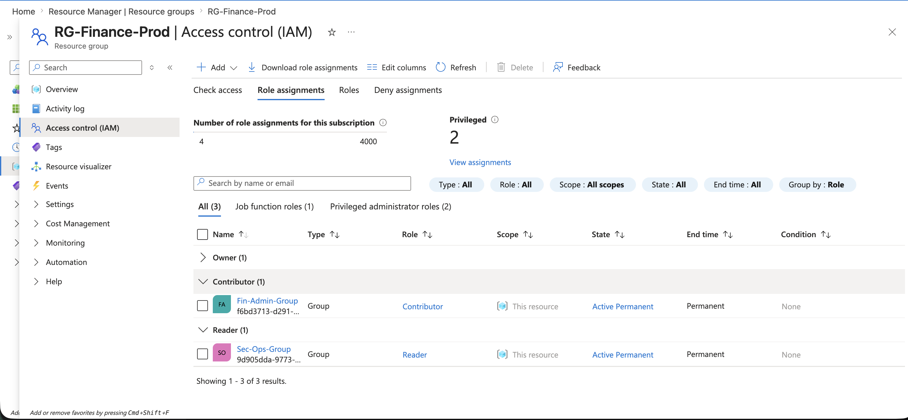
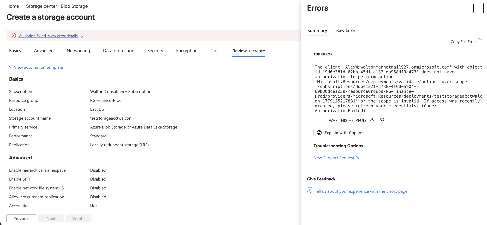
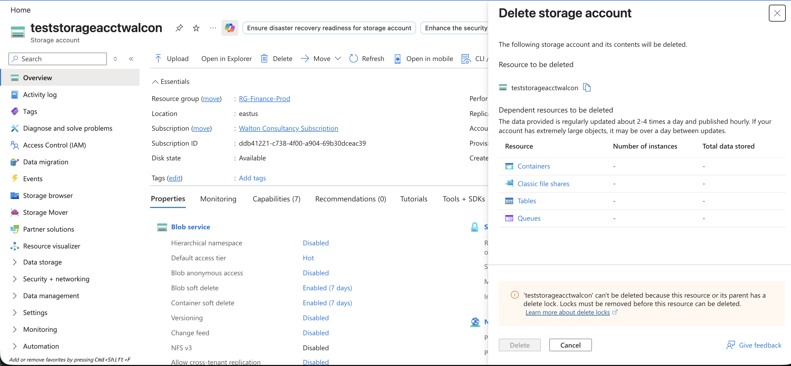

# Azure AZ-104 Infrastructure Lab Portfolio

Welcome to my hands-on Azure infrastructure portfolio. This repository documents my practical implementation of enterprise scenarios mapping directly to the official AZ-104 administration domains.

---

## Domain 1: Manage Azure Identities and Governance

### Project Objective
To establish a highly secure corporate identity perimeter using Microsoft Entra ID, precise Role-Based Access Control (RBAC), and rigid compliance governance guardrails.

### Architecture Features & Verification Logs

#### 1. Identity & Role-Based Access Control (RBAC)
- Isolated administrative boundaries by mapping dedicated enterprise security groups (`Fin-Admin-Group` and `Sec-Ops-Group`).
- Enforced the Principle of Least Privilege (PoLP) by restricting financial production assets to explicit scopes.
- *Verification Log:* Active identity matrix and role allocations:
  

#### 2. Least-Privilege Access Enforcement
- Validated role isolation using an audit test user account to attempt unauthorized modification behaviors.
- *Verification Log:* The Azure control plane successfully terminates unauthorized provisioning actions:

#### 3. Automated Governance Guardrails
- Implemented an Azure Policy assignment enforcing strict regional compliance to prevent shadow IT and cost overruns.
- *Verification Log:* Automated policy intervention blocking a non-compliant deployment layout:

#### 4. Blast-Radius Control & Protection
- Deployed administrative Delete Resource Locks to safeguard core production assets from accidental removal commands.
- *Verification Log:* Native platform defense intercepting a manual deletion attempt:

